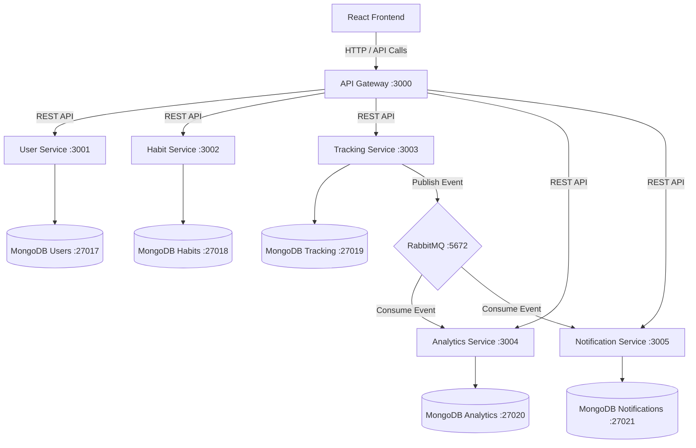

# HabitFlow — Habit Tracker

A production-ready habit tracker built with a microservices architecture, featuring a dark-themed React frontend, real-time analytics, and event-driven data processing.

## Architecture Diagram



## Services & Responsibilities

| Service | Port | Responsibility |
|---------|------|----------------|
| **API Gateway** | 3000 | Request routing, authentication, rate limiting |
| **User Service** | 3001 | Authentication (JWT), user profiles |
| **Habit Service** | 3002 | CRUD operations for habits |
| **Tracking Service** | 3003 | Log completions, streaks |
| **Analytics Service** | 3004 | Insights, trends, heatmaps |
| **Notification Service** | 3005 | Reminders, notifications |

## Tech Stack

| Layer | Technology | Description |
|-------|-----------|-------------|
| **Frontend** | React | Dark-themed responsive user interface |
| **API Gateway** | Express.js | Request routing, rate limiting, and JWT authentication |
| **Microservices**| Node.js 18+, Express.js | 5 independent backend services |
| **Databases** | MongoDB | Database-per-service pattern (5 separate instances) |
| **Message Queue**| RabbitMQ | Asynchronous event-driven communication |
| **Containerization**| Docker, Docker Compose | Local development and building container images |
| **Orchestration**| Kubernetes (EKS/Kind) | Container deployment, scaling, and management |

## Kubernetes Features Checklist

This project leverages various Kubernetes features to ensure a robust, scalable, and manageable deployment:

- [x] F1 (listing soon)

## Habit Types

| Type | Description | Example |
|------|-------------|---------|
| **binary** | Yes/No completion | "Did you meditate?" |
| **count** | Numeric count | "Drank 8 glasses of water" |
| **time** | Time-based | "Ran for 30 minutes" |
| **negative** | Avoiding behavior | "No social media today" |

---

## Quick Start

### Docker Compose (Recommended)

```bash
# Build and start all services
docker-compose up -d --build

# Access the application
# Frontend: http://localhost
# API: http://localhost:3000
# RabbitMQ: http://localhost:15672 (guest/guest)
```

### Kubernetes (Kind)

```bash
# 1. Create Kind cluster
kind create cluster

# 2. Build and load images
docker build -t pateldarsh21/habit-tracker:user-service-v1 -f services/user-service/Dockerfile .
# ... repeat for all services
kind load docker-image pateldarsh21/habit-tracker:user-service-v1
# ... repeat for all services

# 3. Deploy
kubectl apply -f kind-deploy.yaml

# 4. Access via port-forward

kubectl port-forward -n habit-tracker svc/frontend 3000:3000 &

# Access:
# Frontend: http://localhost:8080
```

---

## Demo Account

| Field | Value |
|-------|-------|
| **Email** | `demo@habittracker.com` |
| **Password** | `demo123456` |

### Pre-loaded Habits

| Habit | Type | Schedule |
|-------|------|----------|
| Morning Meditation | time (10 min) | Daily |
| Read 30 Pages | count (30 pages) | Daily |
| Exercise | time (30 min) | Weekdays only |
| Drink 8 Glasses of Water | count (8 glasses) | Daily |
| Journal Writing | binary | Daily |

---

## Features

### Dashboard
- Today's habit checklist with one-click toggle
- Completion rate %, day streak, weekly stats
- Personalized insights

### Habits
- Create habits with type selector
- Color picker with presets
- Pause/resume and delete habits
- Schedule habits for specific days

### Analytics
- Trend Overview (Improving / Declining / Stable)
- Activity Heatmap (GitHub-style)
- Best Days ranking with completion percentages
- Weekly Report

### Notifications
- Unread badge
- Mark as read
- Delete notifications

---

## API Endpoints

### Auth (no token required)

| Method | Endpoint | Description |
|--------|----------|-------------|
| POST | `/api/auth/signup` | Create account |
| POST | `/api/auth/login` | Authenticate |

### Habits (JWT required)

| Method | Endpoint | Description |
|--------|----------|-------------|
| POST | `/api/habits` | Create habit |
| GET | `/api/habits` | List all habits |
| GET | `/api/habits/today` | Today's habits |
| GET | `/api/habits/:id` | Get habit |
| PUT | `/api/habits/:id` | Update habit |
| DELETE | `/api/habits/:id` | Delete habit |

### Tracking (JWT required)

| Method | Endpoint | Description |
|--------|----------|-------------|
| POST | `/api/tracking/log` | Log completion |
| GET | `/api/tracking/today` | Today's records |
| GET | `/api/tracking/stats` | Statistics |
| GET | `/api/tracking/:habitId/streak` | Streak |

### Analytics (JWT required)

| Method | Endpoint | Description |
|--------|----------|-------------|
| GET | `/api/analytics/insights` | Insights |
| GET | `/api/analytics/trends` | Trends |
| GET | `/api/analytics/heatmap` | Heatmap |
| GET | `/api/analytics/best-days` | Best days |


## Design Principles

- **Loose Coupling** — Services communicate via REST APIs and message queues
- **High Cohesion** — Each service owns its data and logic
- **Independent Deployability** — Each service can be deployed separately
- **Event-Driven** — Tracking publishes events; Analytics consumes asynchronously
